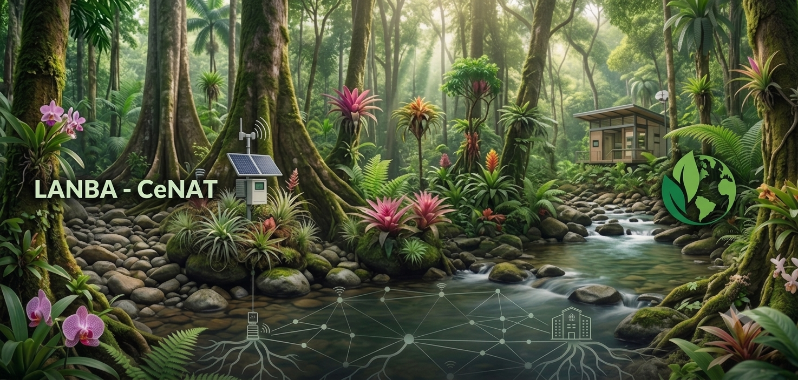

<p align="center">
  
</p>

<h1 align="center">LMS LANBA - CeNAT</h1>

<p align="center">
  Plataforma de gestión y consumo de cursos educativos para el <strong>Laboratorio Nacional de Bioeconomía y Ambiente (LANBA)</strong>,<br>
  del <strong>Centro Nacional de Alta Tecnología (CeNAT)</strong>, Costa Rica.
</p>

<p align="center">
  
  
  
  
  
  
</p>

<p align="center">
  
</p>

## Contenido

- [Sobre el proyecto](#sobre-el-proyecto)
- [Características](#características)
- [Seguridad](#seguridad)
- [Stack tecnológico](#stack-tecnológico)
- [Estructura del proyecto](#estructura-del-proyecto)
- [Puesta en marcha](#puesta-en-marcha)
- [Variables de entorno](#variables-de-entorno)
- [Scripts disponibles](#scripts-disponibles)
- [Pruebas automatizadas](#pruebas-automatizadas)
- [API](#api)
- [Documentación](#documentación)
- [Contexto académico](#contexto-académico)

## Sobre el proyecto

**LMS LANBA - CeNAT** es una plataforma web tipo LMS (*Learning Management System*) construida a la medida para que LANBA pueda publicar cursos educativos en biotecnología ambiental y ciencia abierta, y que sus estudiantes se inscriban, avancen por el contenido y obtengan un certificado de finalización.

Es una aplicación full-stack: backend en **Node.js/Express** con **MySQL**, y un frontend **SPA** (*Single Page Application*) hecho en JavaScript puro (sin frameworks) con **Tailwind CSS**, con ruteo propio basado en el hash de la URL (`#/ruta`).

## Características

**Autenticación y cuentas**
- Registro e inicio de sesión (por correo o por nombre de usuario) con sesiones persistidas en MySQL (no en memoria)
- Modo invitado: navegar el catálogo público sin necesidad de cuenta
- Recuperación de contraseña por correo (Gmail vía Nodemailer, con *fallback* a consola si no hay credenciales configuradas) — invalida todas las sesiones activas del usuario al completarse
- Tres roles: **estudiante**, **profesor** (gestiona los cursos que tiene asignados vía `course_teachers`) y **administrador**
- Foto de perfil (avatar) para cualquier rol, con la misma validación de firma binaria que el resto de imágenes
- Mostrar/ocultar contraseña en los formularios de login, registro y restablecimiento

**Cursos y contenido**
- CRUD de cursos con paginación server-side (catálogo, panel admin, usuarios, estudiantes de un curso, entregas de tarea)
- Diez tipos de contenido: **video**, **archivo**, **imagen**, **texto**, **URL** (con vista previa embebida de YouTube/Vimeo y detección real de errores de reproducción), **tarea** (entrega única + revisión del profesor), **foro** de discusión (hasta 2 niveles de anidamiento, moderable), **carpeta** (agrupa contenido en un solo nivel), **cuestionario** y **encuesta** (opción múltiple, verdadero/falso o respuesta corta, con calificación automática o manual)
- Editor completo de preguntas de un cuestionario/encuesta ya creado — bloqueado una vez que algún estudiante respondió, para no perder respuestas reales
- Reordenamiento de contenido por *drag & drop*, con botones de subir/bajar como alternativa accesible por teclado
- Edición de contenido existente (título, descripción, archivo) para los diez tipos, sin necesidad de borrar y recrear
- Validación de archivos por firma binaria real (no solo por extensión/MIME), incluyendo avatares
- Descarga de archivos protegida: siempre pasa por el backend, que valida sesión e inscripción (o rol de profesor asignado) antes de servir el archivo

**Progreso y certificación**
- Seguimiento de progreso por contenido y por curso (excluye contenido puramente decorativo: imágenes, foros y carpetas)
- Certificado de finalización en PDF, generado con el logo de LANBA embebido
- Vista de progreso por estudiante para el profesor/administrador

**Interfaz**
- Modo oscuro, control de tamaño de letra
- Identidad visual de LANBA (verde `#007031` tomado del logo real)
- Diseño responsive

## Seguridad

El proyecto pasó por tres rondas de revisión de seguridad (31 hallazgos identificados y corregidos en total — ver [`docs/Pruebas_Seguridad_LMS_CENAT.docx`](docs/Pruebas_Seguridad_LMS_CENAT.docx)). Entre las medidas implementadas:

| Medida | Detalle |
|---|---|
| Cabeceras HTTP | [Helmet](https://helmetjs.github.io/) en todas las respuestas, con una política Content-Security-Policy real (no desactivada) |
| Rate limiting | Límites por IP/usuario en login, registro, recuperación de contraseña, inscripción, creación de cursos y publicaciones del foro |
| Sesiones | Almacenadas en MySQL (no `MemoryStore`), cookies `httpOnly`, `sameSite=lax`, `secure` en producción; se invalidan todas al restablecer la contraseña |
| Secretos | La app no arranca si falta `SESSION_SECRET` en el entorno |
| Contraseñas | Hasheadas con `bcrypt`, nunca en texto plano |
| Archivos subidos | Validación por firma binaria real (`file-type`), no solo por extensión, incluyendo avatares |
| Control de acceso | Descargas y contenido de curso siempre verifican sesión + inscripción (o rol de profesor asignado) en el backend |
| Integridad transaccional | Operaciones de varios pasos (crear cuestionario, asignar profesores, desinscribir) usan transacciones de MySQL — todo o nada ante un fallo a mitad de camino |
| Inyección | Sin XSS almacenado (escapado consistente en atributos HTML) ni SQL (parámetros preparados en todas las consultas) |
| Manejo de errores | En producción, los errores 500 no filtran detalles internos (rutas, mensajes de MySQL, *stack traces*); manejo a nivel de proceso y apagado ordenado ante señales de terminación |
| Dependencias | `npm audit` limpio |

## Stack tecnológico

| Capa | Tecnologías |
|---|---|
| Backend | Node.js, Express 5, MySQL (`mysql2`), `express-session` + `express-mysql-session`, `bcryptjs` |
| Subida de archivos | `multer`, `file-type` (validación de firma binaria) |
| Seguridad | `helmet`, `express-rate-limit` |
| Correo | `nodemailer` (Gmail) |
| Certificados | `pdfkit` |
| Frontend | JavaScript vanilla (SPA con router propio en hash), Tailwind CSS (CDN), Font Awesome |
| Tests | `node:test` (test runner nativo de Node, sin dependencias externas) |

## Estructura del proyecto

```
lms-cenat/
├── src/
│   ├── app.js                  # Punto de entrada de Express (Helmet/CSP, sesión, health check, apagado ordenado)
│   ├── config/                 # Conexión a MySQL, configuración de correo
│   ├── controllers/            # auth, course, content, quiz, forum, submission, user
│   ├── middlewares/            # Auth (incl. requireCourseManager), rate limiting, validación de archivos, uploads
│   ├── models/                 # Content, ContentQuestion, ContentAnswer, Course, ForumPost, TaskSubmission, User
│   ├── routes/                 # Un archivo de rutas por dominio (auth, courses, contents, users, submissions, forum-posts)
│   ├── utils/                  # Generación de certificados PDF
│   └── public/                 # Frontend (servido como estático)
│       ├── index.html          # Shell de la SPA
│       ├── css/                # Estilos personalizados
│       ├── images/             # Logos e imágenes de marca
│       └── js/                 # Router, vistas y utilidades del frontend
├── database/
│   └── cenat1.sql              # Esquema + datos base para importar
├── tests/                      # Pruebas automatizadas (node:test)
├── docs/                       # Manuales técnico, de usuario y de pruebas de seguridad
└── uploads/                    # Videos, archivos y miniaturas subidos (no versionado)
```

## Puesta en marcha

### Requisitos

- [Node.js](https://nodejs.org/) 18 o superior
- Un servidor MySQL (local o remoto)

### Pasos

```bash
# 1. Clonar el repositorio
git clone https://github.com/MAU312/plataformaLMS.git
cd plataformaLMS

# 2. Instalar dependencias
npm install

# 3. Configurar variables de entorno
cp .env.example .env
# Edita .env con tus credenciales de MySQL y genera un SESSION_SECRET propio:
node -e "console.log(require('crypto').randomBytes(32).toString('hex'))"

# 4. Crear la base de datos e importar el esquema
mysql -u tu_usuario -p -e "CREATE DATABASE lms_cenat"
mysql -u tu_usuario -p lms_cenat < database/cenat1.sql

# 5. Levantar el servidor
npm run dev     # con recarga automática (nodemon)
# o
npm start       # modo normal
```

La app queda disponible en `http://localhost:3000` (o el puerto que definas en `PORT`).

> **Nota:** la carpeta `uploads/` no viaja en el repositorio (está en `.gitignore`). El servidor crea las subcarpetas vacías automáticamente al arrancar; si necesitas los archivos de ejemplo (videos, PDFs, miniaturas) de otra instalación, cópialos manualmente.

## Variables de entorno

Definidas en `.env` (ver [`.env.example`](.env.example)):

| Variable | Descripción |
|---|---|
| `DB_HOST`, `DB_USER`, `DB_PASS`, `DB_NAME` | Credenciales de conexión a MySQL |
| `PORT` | Puerto del servidor (por defecto `3000`) |
| `NODE_ENV` | `development` o `production` |
| `SESSION_SECRET` | Obligatorio. Genera uno propio, nunca uses un valor de ejemplo |
| `EMAIL_USER`, `EMAIL_APP_PASSWORD` | Cuenta de Gmail para el correo de recuperación de contraseña (opcional: si se dejan vacíos, el enlace se muestra en la consola del servidor) |
| `APP_URL` | URL pública de la app, usada para armar el enlace de recuperación de contraseña |

## Scripts disponibles

| Comando | Descripción |
|---|---|
| `npm start` | Inicia el servidor (`node src/app.js`) |
| `npm run dev` | Inicia el servidor con recarga automática (`nodemon`) |
| `npm test` | Corre la suite de pruebas automatizadas |

## Pruebas automatizadas

274 pruebas con el test runner nativo de Node (`node --test`), que mockean modelos y el pool de MySQL — **no requieren una base de datos real corriendo**:

```bash
npm test
```

Cubren todos los controladores (auth, cursos, contenidos, quiz, foro, entregas, usuarios), middleware de validación de archivos, y todos los modelos (cálculo de progreso, reordenamiento, preguntas/respuestas de cuestionarios, entregas de tareas).

## API

Todos los endpoints cuelgan de `/api`. Los que requieren sesión están marcados 🔒, y los que además requieren rol de administrador (o profesor asignado al curso, donde se indica) 🔒👑.

**`/api/auth`**

| Método | Ruta | Descripción |
|---|---|---|
| POST | `/register` | Registro de usuario (siempre rol estudiante) |
| POST | `/login` | Inicio de sesión, por correo o nombre de usuario |
| POST | `/logout` | Cerrar sesión |
| GET | `/me` 🔒 | Usuario autenticado actual |
| GET | `/check` | Verificar estado de sesión |
| POST | `/forgot-password` | Solicitar enlace de recuperación |
| POST | `/reset-password` | Restablecer contraseña con token (invalida las demás sesiones activas) |

**`/api/courses`**

| Método | Ruta | Descripción |
|---|---|---|
| GET | `/` | Catálogo de cursos (paginado) |
| GET | `/enrolled` 🔒 | Cursos en los que estoy inscrito |
| GET | `/teaching` 🔒 | Cursos donde estoy asignado como profesor |
| GET | `/stats/summary` 🔒👑 | Estadísticas globales |
| GET | `/:id` | Detalle de un curso |
| POST | `/` 🔒👑 | Crear curso |
| PUT | `/:id` 🔒👑 | Editar curso |
| DELETE | `/:id` 🔒👑 | Eliminar curso |
| POST / DELETE | `/:id/enroll` 🔒 | Inscribirse / darse de baja |
| GET | `/:id/stats` 🔒👑 | Estadísticas del curso |
| GET | `/:id/certificate` 🔒 | Descargar certificado en PDF |
| GET | `/:id/students` 🔒👑 | Progreso de estudiantes inscritos (paginado) |
| GET | `/:id/teachers` 🔒👑 | Profesores asignados al curso |

**`/api/contents`** — CRUD genérico + creación por tipo (`video`, `file`, `image`, `text`, `url`, `task`, `forum`, `folder`, `quiz`, `survey`), todos 🔒👑 para crear/editar/eliminar/reordenar

| Método | Ruta | Descripción |
|---|---|---|
| GET | `/course/:courseId` | Contenidos de un curso |
| PUT | `/course/:courseId/reorder` 🔒👑 | Reordenar contenidos (*drag & drop* o botones) |
| POST | `/video`, `/file`, `/image`, `/text`, `/url`, `/task`, `/forum`, `/folder`, `/quiz`, `/survey` 🔒👑 | Crear contenido de cada tipo |
| GET | `/:id` | Detalle de un contenido |
| PUT / DELETE | `/:id` 🔒👑 | Editar / eliminar contenido |
| POST / DELETE | `/:id/complete` 🔒 | Marcar / desmarcar completado |
| GET | `/:id/download` 🔒 | Descargar archivo (valida inscripción) |
| POST | `/:id/submit` 🔒 | Entregar una tarea |
| GET | `/:id/submission` 🔒 | Mi entrega de una tarea |
| GET | `/:id/submissions` 🔒👑 | Entregas de una tarea (paginado) |
| GET / POST | `/:id/forum` 🔒 | Ver / responder el hilo de un foro |
| GET | `/:id/questions` 🔒 | Preguntas de un cuestionario/encuesta para responder |
| POST | `/:id/answers` 🔒 | Enviar respuestas (un intento) |
| GET | `/:id/results` 🔒👑 | Resultados de un cuestionario/encuesta |
| GET | `/:id/questions/manage` 🔒👑 | Preguntas completas para editar |
| PUT | `/:id/questions` 🔒👑 | Reemplazar preguntas (bloqueado si ya hay respuestas) |
| PUT | `/answers/:answerId/grade` 🔒👑 | Calificar manualmente una respuesta corta |

**`/api/submissions`** — 🔒 (entregas de tareas)

| Método | Ruta | Descripción |
|---|---|---|
| GET | `/:id/download` | Descargar el archivo de una entrega |
| PUT | `/:id/review` 🔒👑 | Calificar/revisar una entrega |

**`/api/forum-posts`** — 🔒 (moderación de respuestas del foro)

| Método | Ruta | Descripción |
|---|---|---|
| PUT | `/:id` | Editar una respuesta propia |
| DELETE | `/:id` | Eliminar una respuesta (autor, profesor del curso, o admin) |

**`/api/users`**

| Método | Ruta | Descripción |
|---|---|---|
| PUT / DELETE | `/me/avatar` 🔒 | Subir/reemplazar o quitar mi propia foto de perfil |
| resto | `/*` 🔒👑 | Gestión de usuarios: crear (cualquier rol), listar, ver, editar, activar/desactivar, eliminar, estadísticas |

## Documentación

En [`docs/`](docs/):

- **Manual técnico** — arquitectura, referencia completa de la API, modelo de datos y decisiones de diseño
- **Manual de usuario** — guía de uso para estudiantes, profesores y administradores
- **Pruebas de seguridad** — los 31 hallazgos identificados y su corrección

## Contexto académico

Este proyecto es el trabajo de graduación (TCU — Trabajo Comunal Universitario, 150 horas) de **Ingeniería en Sistemas** en la **Universidad Fidélitas**, desarrollado para el **CeNAT** (Costa Rica). Uso académico e institucional.
